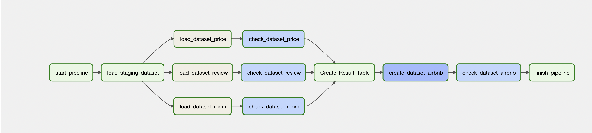

# BigQuery-Cloud-ComposerProject
Send data to Bucket. From here, a flow has been created that will take it with Cloud Composer and perform the necessary operations and send the data to Bigquery.

Flow;

